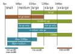

# Media-breakpoint
Sass mixins to manage breakpoint and device media query

## Breakpoint
```scss
@include breakpoint(query list){
  //content
};
```
The mixin take as argument a sass list of values. This list is parsed to define an interval between two breakpoint. The first value represent the minimum, and the second represent the maximum. If the second value is omitted infinity is assumed.

The up, down and only keyword are used to better define the interval. 

| keyword | meaning |
| ------------- | ------------- |
| only  | between the first and the second breakpoint |
| up  | from the first breakpoint to infinity |
| down | from 0 to the second breakpoint |

When two value are provided the only keyword is assumed. When one value is provided the up keyword is assumed

Values can be specified using px, em or rem. Generated media queries are converted to em assuming a 16px font-size ([PX, EM or REM Media Queries?](https://zellwk.com/blog/media-query-units/)). 

The $breakpoints map is used to generate intervals in your project. An interval start with the value provided inside the map and end a pixel before the next key. When using a key from the map the up keyword is assumed. 

```scss
$breakpoints: (
  small: 0px,
  medium: 640px,
  large: 1024px,
  xlarge: 1200px,
  xxlarge: 1440px,
) !default;
```



Keys can be redefined to better suit your project

```scss
$breakpoints: (
  smartphone: 0,
  tablet: 40em,
  desktop: 64em,
  large-desktop: 75em,
);
```


### Examples
```scss
.element {
  // Only affects tablet screens and larger
  @include breakpoint(tablet) {
    // All CSS in here goes inside the media query
  }  
  // Only affects tablet screens and smaller
  @include breakpoint(tablet down) { }
  // Only affects tablet screens, not smartphone or desktop
  @include breakpoint(tablet only) { }
  // Only affects screens between smartphone and desktop, not large-desktop
  @include breakpoint(smartphone desktop) { }
}
```

| Sass  | Css |
| ------------- | ------------- |
| @include breakpoint(large)  | @media (min-width: 64em)  |
| @include breakpoint(desktop down) | @media (max-width: 81.1875em)  |
| @include breakpoint(small large)  | @media (min-width: 40em) and (max-width: 74.9375em)  |
| @include breakpoint(xxlarge only)  | @media (min-width: 90em)  |
| @include breakpoint(10px)  | @media (min-width: 0.625em)  |
| @include breakpoint(small 200px) | @media (min-width: 0em) and (max-width: 12.5em) |

### Context
use function `mb-context(variable)` to retreive values from the current context.
| variable  | value | default |
| ------------- | ------------- | ------------- |
| min  | number in em  |null |
| max  | number in em  |null |


## Media
```scss
@include media(query list){
  //content
};
```
You can use media mixin to affect different pixel density (x, dpi or dppx) , device orientation (portrait or landscape), or device type (screen, speech, or print). Each combination of those string is valid.

### Example
```scss
.element {
  // Only affects retina display
  @include media(2x) {
    // All CSS in here goes inside the media query
  }  
  // Only affects device in landscape
  @include media(landscape) { }
  // Only affects screen reader
  @include media(speech) { }
}
```

| Sass  | Css |
| ------------- | ------------- |
| @include media(landscape)  | @media (orientation: landscape)  |
| @include media(2.5dppx) | @media (-webkit-min-device-pixel-ratio: 2.5), (min-resolution: 240dpi)  |
| @include media(screen portrait 3x)  | @media only screen and (orientation: portrait) and (-webkit-min-device-pixel-ratio: 3), only screen and (orientation: portrait) and (min-resolution: 288dpi)  |

### Context
use function `mb-context(variable)` to retreive values from the current context.
| variable  | value | default |
| ------------- | ------------- | ------------- |
| resolution  | number with unit (x, dpi, dppx)  | null |
| orientation  | landscape, portrait  | all |
| device  | screen, print, speech  | all |

## Use media and breakpoint together
You can use media and breakpoint mixins together by nesting one inside the other.

```scss
selector {
  @include breakpoint(large only){
    @include media(screen landscape 2x){
      test: "@include breakpoint(large only) -> @include media(screen landscape 2x)";
    }
  }
}
```

```css
@media only screen and (min-width: 64em) and (max-width: 74.9375em) and (orientation: landscape) and (-webkit-min-device-pixel-ratio: 2), only screen and (min-width: 64em) and (max-width: 74.9375em) and (orientation: landscape) and (min-resolution: 192dpi) {
  selector {
    test: "@include breakpoint(large only) -> @include media(screen landscape 2x)"; 
  } 
}
```
